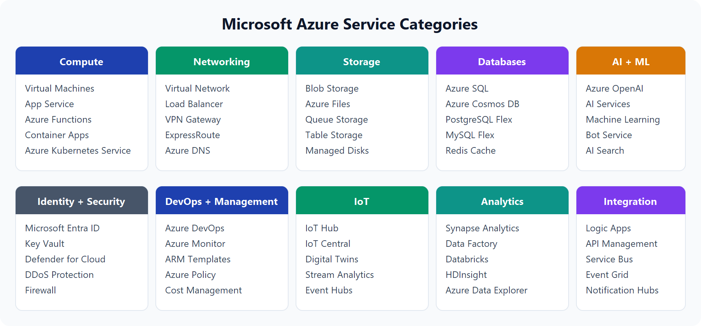
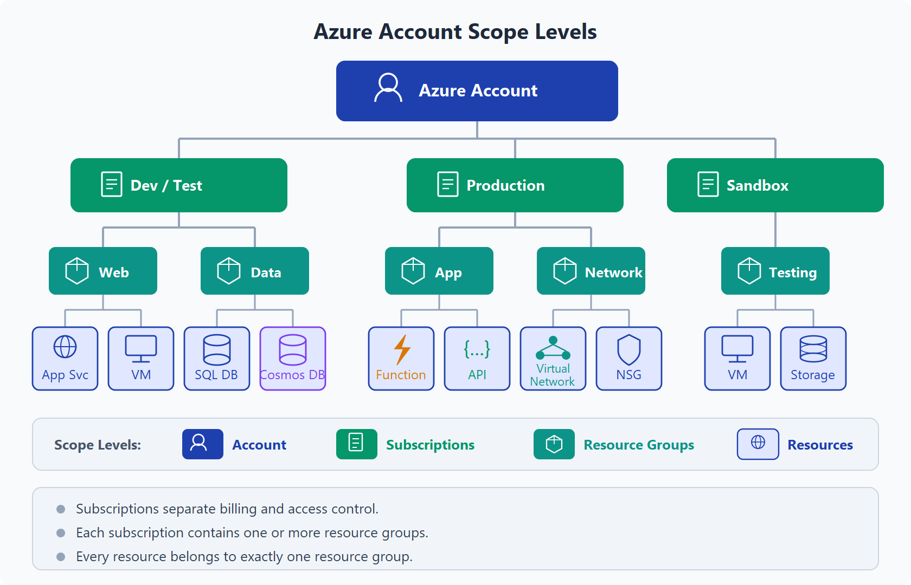
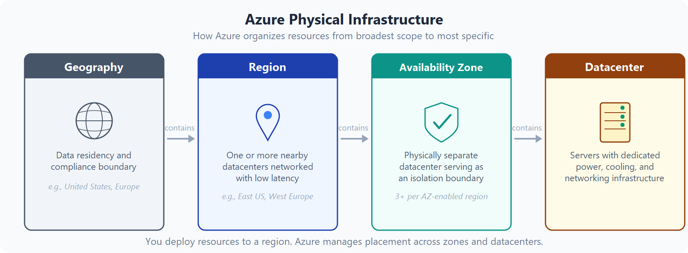
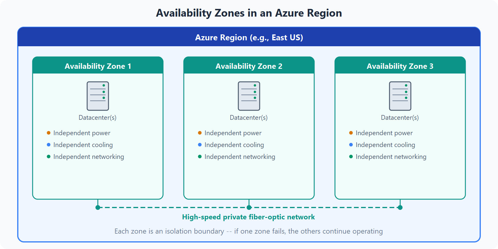
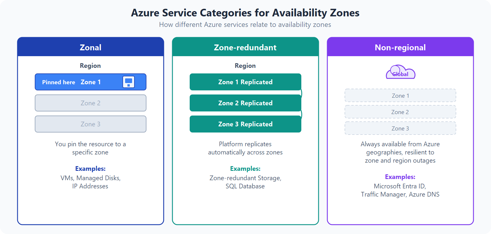
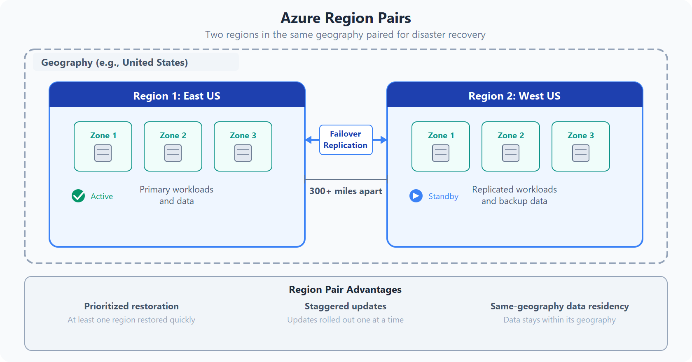

# Describe the core architectural components of Azure

## Introduction

In this module, you’ll be introduced to the core architectural components of Azure. You’ll learn about Azure's physical layout: datacenters, availability zones, and regions; and you’ll learn about Azure's management structure: resources and resource groups, subscriptions, and management groups.

### Learning objectives
After completing this module, you’ll be able to:

* Describe Azure regions, region pairs, and sovereign regions.
* Describe Availability Zones.
* Describe Azure datacenters.
* Describe Azure resources and Resource Groups.
* Describe subscriptions.
* Describe management groups.
* Describe the hierarchy of resource groups, subscriptions, and management groups.

## What is Microsoft Azure

Azure is a continually expanding set of cloud services that help you meet current and future IT challenges. Azure gives you the freedom to build, manage, and deploy applications on a massive global network using your favorite tools and frameworks.

### What does Azure offer?

**Limitless innovation**. Build intelligent apps and solutions with advanced technology, tools, and services to take your operations to the next level. Seamlessly unify your technology to simplify platform management and deliver innovations efficiently and securely on a trusted cloud.

* **Bring ideas to life:** Build on a trusted platform to advance your team's capabilities with industry-leading AI and cloud services.
* **Seamlessly unify:** Efficiently manage all your infrastructure, data, analytics, and AI solutions across an integrated platform.
* **Innovate on trust:** Rely on trusted technology from a partner who's dedicated to security and responsibility.

### What can I do with Azure?
Azure provides hundreds of services that enable you to do everything from running your existing applications on virtual machines to exploring new software paradigms, such as intelligent bots and generative AI.

Many teams start exploring the cloud by moving their existing applications to virtual machines (VMs) that run in Azure. Migrating your existing apps to VMs is a good start, but the cloud is much more than a different place to run your VMs.

As your skills grow, you can modernize one workload at a time, such as moving from manually managed servers to managed databases, autoscaling web apps, or event-driven services.

### Practical example
Suppose your organization runs an internal app with seasonal demand spikes. In Azure, you can host the app on virtual machines or managed app services, store data in managed databases, and monitor health from a centralized dashboard. As demand increases, you can scale resources up or out and then scale back when demand drops so you're not paying for unused capacity year-round.

For example, Azure provides Azure AI services and Azure OpenAI Service so you can add language, vision, speech, and generative AI capabilities to your applications. It also provides Azure Machine Learning, Internet of Things (IoT) services, and storage solutions that dynamically grow to accommodate massive amounts of data. Azure services enable solutions that aren't feasible without the power of the cloud.

## Get started with Azure accounts

To create and use Azure services, you need an Azure subscription. When you're working with your own applications and workloads, you create an Azure account, and a subscription is created for you. After you've created an Azure account, you're free to create additional subscriptions. For example, your team might use a single Azure account and separate subscriptions for development, testing, and production workloads. After you've created an Azure subscription, you can start creating Azure resources within each subscription.

If you're new to Azure, you can sign up for a free account on the Azure website to start exploring at no cost to you. When you're ready, you can choose to upgrade your free account. You can also create a new subscription that enables you to start paying for Azure services you need beyond the limits of a free account.

## Create an Azure account

You can purchase Azure access directly from Microsoft by signing up on the Azure website or through a Microsoft representative. You can also purchase Azure access through a Microsoft partner. Cloud Solution Provider partners offer a range of complete managed-cloud solutions for Azure.

## Describe Azure physical infrastructure

Azure's core architectural components can be broken down into two main groupings: the physical infrastructure and the management infrastructure. This unit covers the physical side — how Azure organizes its datacenters, regions, and availability zones to deliver reliable services worldwide.

### Physical infrastructure
The physical infrastructure for Azure starts with datacenters. These datacenters are facilities with servers arranged in racks, with dedicated power, cooling, and networking infrastructure — similar to an on-premises datacenter, but at a much larger scale.

As a global cloud provider, Azure has datacenters around the world. However, you don't interact with individual datacenters directly. Instead, datacenters are grouped into Azure Regions and Azure Availability Zones that provide resiliency and reliability for your workloads.

### Regions
A region is a geographical area on the planet that contains at least one, but potentially multiple datacenters that are nearby and networked together with a low-latency network. Azure intelligently assigns and controls the resources within each region to ensure workloads are appropriately balanced.

When you deploy a resource in Azure, you'll often need to choose the region where you want your resource deployed.

> [!NOTE]
> Some services or virtual machine (VM) features are only available in certain regions, such as specific VM sizes or storage types. There are also some global Azure services that don't require you to select a particular region, such as Microsoft Entra ID, Azure Traffic Manager, and Azure DNS.

### Availability Zones
Availability zones are physically separate datacenters within an Azure region. Each availability zone is made up of one or more datacenters equipped with independent power, cooling, and networking. An availability zone is set up to be an isolation boundary. If one zone goes down, the other continues working. Availability zones are connected through high-speed, private fiber-optic networks.

> [!IMPORTANT]
> To ensure resiliency, a minimum of three separate availability zones are present in all availability zone-enabled regions. However, not all Azure Regions currently support availability zones.

### Use availability zones for your workloads
When you run your own on-premises infrastructure, setting up redundancy means buying and maintaining duplicate hardware. With Azure, you can protect your workloads by spreading them across availability zones within a region.

You place your VMs, storage, databases, and other resources in one availability zone and replicate them to other zones within the same region. Keep in mind that there could be a cost to duplicating your services and transferring data between zones.

Azure services that support availability zones fall into three categories:

* Zonal services: You pin the resource to a specific zone (for example, VMs, managed disks, IP addresses).
* Zone-redundant services: The platform replicates automatically across zones (for example, zone-redundant storage, SQL Database).
* Non-regional services: Services are always available from Azure geographies and are resilient to zone-wide outages as well as region-wide outages.

Even with the additional resiliency that availability zones provide, it’s possible that an event could be so large that it impacts multiple availability zones in a single region. To provide even further resilience, Azure has Region Pairs.

### Region pairs
Most Azure regions are paired with another region within the same geography (such as US, Europe, or Asia) at least 300 miles away. This approach allows for the replication of resources across a geography that helps reduce the likelihood of interruptions because of events such as natural disasters, civil unrest, power outages, or physical network outages that affect an entire region. For example, if a region in a pair was affected by a natural disaster, services would automatically fail over to the other region in its region pair.

> [!IMPORTANT]
> Not all Azure services automatically replicate data or automatically fall back from a failed region to cross-replicate to another enabled region. In these scenarios, recovery and replication must be configured by the customer.

Examples of region pairs in Azure are West US paired with East US and Southeast Asia paired with East Asia. Because the pair of regions is directly connected and far enough apart to be isolated from regional disasters, you can use them to provide reliable services and data redundancy.

### Additional advantages of region pairs:
* If an extensive Azure outage occurs, one region out of every pair is prioritized to make sure at least one is restored as quickly as possible for applications hosted in that region pair.
* Planned Azure updates are rolled out to paired regions one region at a time to minimize downtime and risk of application outage.
* Data continues to reside within the same geography as its pair (except for Brazil South) for data-residency and compliance purposes.

> [!IMPORTANT]
> Most regions are paired in two directions, meaning they are the backup for the region that provides a backup for them (West US and East US back each other up). However, some regions, such as Brazil South, are paired in only one direction. In a one-direction pairing, the Primary region does not provide backup for its secondary region. Brazil South is unique because it's paired with a region outside of its geography. Brazil South's secondary region is South Central US. The secondary region of South Central US isn't Brazil South. Additionally, some regions (such as Italy North, Poland Central, and Israel Central) don't have a traditional region pair and instead rely on availability zones and geo-redundant storage for resiliency.

### Sovereign Regions
In addition to regular regions, Azure also has sovereign regions. Sovereign regions are instances of Azure that are isolated from the main instance of Azure. You may need to use a sovereign region for compliance or legal purposes.

Azure sovereign regions include:

* US DoD Central, US Gov Virginia, US Gov Arizona, and more: These regions are physical and logical network-isolated instances of Azure for U.S. government agencies and partners. These datacenters are operated by screened U.S. personnel and include additional compliance certifications.
* China East, China North, and more: These regions are available through a unique partnership between Microsoft and 21Vianet, whereby Microsoft doesn't directly maintain the datacenters.
