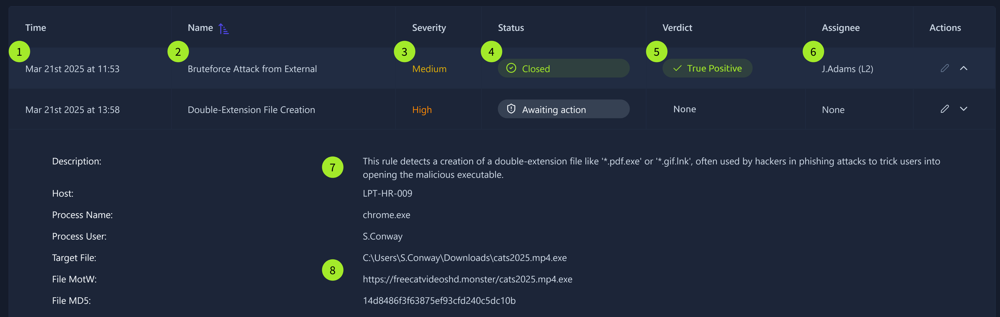
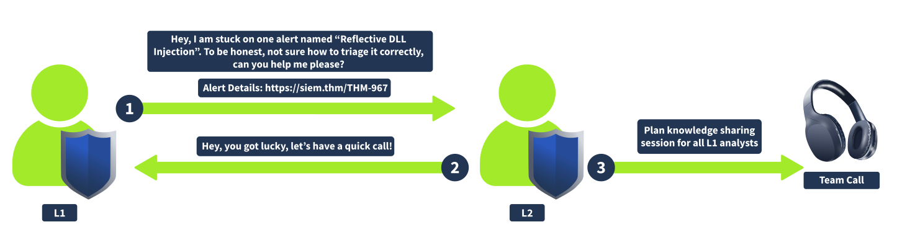
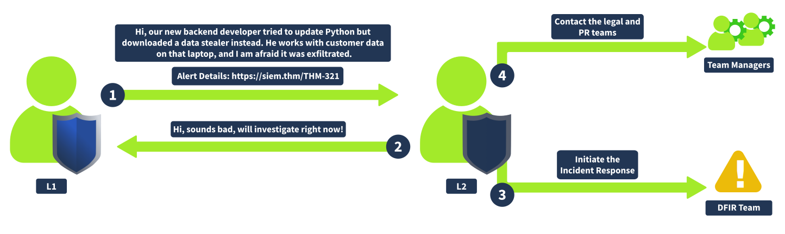

# SOC Level 1
This path introduces a wide array of essential defensive security topics and real-world analysis scenarios. By completing it, you will gain the knowledge and practical skills needed to become a successful SOC Level 1 Analyst, or to better structure your existing expertise if you are already working in the field.

## Introduction

The Security Operations Center (SOC) is a central hub for securing many large organizations, and junior analysts are among the most numerous and demanding roles in a SOC. In the analyst role, you will work with logs, triage and prioritize alerts, collaborate with your teammates and other departments, and be the first line of defense in reacting to cyber incidents. This comprehensive path covers the necessary technical and operational skills to make you a qualified, universal SOC analyst.

Learn the skills needed to jumpstart your career as a SOC Level 1 Analyst or Security Analyst.

Learn SOC tools and operations
Explore network and web attacks
Monitor endpoints for threats
Utilise SIEM to handle incidents

### SOC Role in Blue Team

.

Looking at the diagram above, top executives like the CEO usually focus on global business objectives and don't manage technical aspects. That's why they hire a Chief Information Security Officer (CISO) or a similar role who knows the business needs and can create the most suitable security departments.

#### Security Departments
In tiny companies, the IT department takes the role of securing the company. Small to medium-sized companies may have a generic "Information Security" team that does all sorts of tasks. For this room, we will focus on bigger companies with a CISO overseeing multiple security teams, each handling a specific task. For example:

**Red Team:** Offensive security experts, pentesters, or ethical hackers who look for security issues

**GRC Team:** Specialists managing policies and ensuring compliance with regulations like PCI DSS

**Blue Team:** Defensive security experts like SOC analysts, engineers, or incident responders

### Security Operations Center (SOC)

Blue Team is about defensive security, meaning it constantly monitors for attacks and tries to respond to them quickly. Depending on a company's size and sector, Blue Team can include a lot of different roles and subdepartments, usually counting 3 to 50 members total. Now, let's explore the most common Blue Team departments.

.

That's where you are most likely to start your cyber security journey! SOC is the central hub for an organization's cyber security - they are the first line of defense, work with various alerts, and handle most attacks. You can read more about SOC structure in this room, but an efficient SOC is usually composed of the following roles:

**L1 Analysts:** Junior members who triage alerts and pass complex cases to L2

**L2 Analysts:** Experienced members who investigate more advanced attacks

**Engineers:** Experts in configuring security tools like EDR or SIEM

**Manager:** A person who manages the whole SOC team

### Cyber Incident Response Team (CIRT)

.

If SOC expertise is not enough or the incident goes out of control, you urgently call the "firefighters" - CIRT, also called CSIRT or CERT. The members should have a broad knowledge of cyber threats and handle breaches without depending on tools like EDR (Endpoint Detection and Response) or SIEM. A CIRT job is stressful and responsible, but also rewarding. Here are a few CIRT examples:

JPCERT: Japan's CERT handling nation-wide breaches
Mandiant: A private team responding to global cyber incidents
AWS CIRT: Investigates security incidents of AWS customers

### Specialized Defensive Roles

.

Large companies, technology-focused startups, and government agencies often require narrow and specialized Blue Team roles - exciting and highly valuable, but requiring deep topic knowledge and broad experience in broader fields like SOC or IT. These narrow roles can include:

**Digital Forensics Analyst:** Uncover hidden threats in disk and memory
**Threat Intelligence Analyst:** Gather data about emerging threat groups
**AppSec Engineer:** Maintain a secure software development lifecycle
**AI Researcher:** Study AI threats and how to defend against them

### SOC Path
Starting as a SOC L1 analyst may be a great option to broaden your cyber world awareness and better understand the more specialized roles. Moreover, even the entry-level SOC L1 role can be fun and engaging: You will deal with real attacks, protect the company from advanced threat groups, and learn a lot during the process. 

#### Internal SOC vs MSSP
Not every organization has the expertise to operate a SOC on its own and relies on a Managed Security Services Provider (MSSP), a company that delivers outsourced security services, most commonly SOC, to its clients. Working at MSSP is typically high-pressure, but it is also a good option to quickstart your career. While we recommend applying for any open SOC position as your first job, it's also important to understand the differences:

Internal SOC vs MSSP Comparison

| Topic | Internal SOC | MSSP |
|-------|-------------|------|
| **Scenario Example** | You work in a SOC team of the bank and protect the bank's systems | You work for a global MSSP protecting its sixty customers in Europe |
| **Working Pace** | You usually have calm shifts without too much time pressure | Your shift usually starts from a queue of urgent alerts to analyze |
| **Security Tools** | You work with just a few tools, but need to know them very well | You have to work with sixty diverse security tools and platforms |
| **Incident Practice** | You saw and learned from just two major cyber attacks last year | Every week, you deal with attacks and breaches, and can learn from it |

### SOC L1 Alert Triage

#### From Events to Alerts

First, an event must occur, like user login, process launch, or file download. Then, the system, like your OS, a firewall, or a cloud provider must log the event. After that, all system logs must be shipped to a security solution like SIEM or EDR. The SOC team can receive millions of logs per day from thousands of different systems, where most of the events are expected, but some require attention. Alert, a notification generated by a security solution when a specific event or sequence of events occurs, is what saves SOC analysts from manual log review by highlighting only suspicious, anomalous events. With alerts, analysts triage just dozens of alerts per day instead of millions of raw logs.

**Alert Management Platforms**

| Solution        | Examples                     | Description |
|----------------|------------------------------|------------|
| SIEM System    | Splunk ES, Elastic           | SIEM systems have solid alert management capabilities and are a perfect choice for most SOC teams. |
| EDR or NDR     | MS Defender, CrowdStrike     | While EDR and NDR provide their own alert dashboards, it is preferred to use SIEM or SOAR for centralized alert management. |
| SOAR System    | Splunk SOAR, Cortex SOAR     | Larger SOC teams can use SOAR to aggregate and centralize alerts from multiple security solutions. |
| ITSM System    | Jira, TheHive                | Some teams may have a custom ticket management (ITSM) setup using a dedicated solution. |

### L1 Role in Alert Triage
SOC L1 analysts are the first line of defence, and they are the ones who work with alerts the most. Depending on various factors, L1 analysts may receive zero to a hundred alerts a day, every one of which can reveal a cyberattack. Still, everyone in the SOC team is somehow involved in the alert triage:

* SOC L1 analysts:  Review the alerts, distinguish bad from good, and notify L2 analysts in case of a real threat
* SOC L2 analysts:  Receive the alerts escalated by L1 analysts and perform deeper analysis and remediation
* SOC engineers:  Ensure the alerts contain enough information required for efficient alert triage
* SOC manager:  Track speed and quality of alert triage to ensure that real attacks won't be missed

Now that you know how alerts are generated, it's time to review their content. While the details differ for every SIEM or security solution, the alerts generally have a few main properties you must understand before taking them. Don't worry if you find some confusing, as you will hear more about some in the upcoming tasks.

.

## Alert Properties

| No | Property            | Description | Examples |
|---|---------------------|------------|----------|
| 1 | Alert Time          | Shows alert creation time. The alert usually triggers a few minutes after the actual event. | Alert Time: March 21, 15:35   Event Time: March 21, 15:32 |
| 2 | Alert Name          | Provides a summary of what happened, based on the detection rule's name. | Unusual Login Location   Email Marked as Phishing   Windows RDP Bruteforce   Potential Data Exfiltration |
| 3 | Alert Severity      | Defines the urgency of the alert. Initially set by detection engineers, but can be altered by analysts if needed. | 🟢 Low / Informational   🟡 Medium / Moderate   🟠 High / Severe   🔴 Critical / Urgent |
| 4 | Alert Status        | Indicates whether someone is working on the alert or if triage is completed. | 🆕 New / Unassigned   🔄 In Progress / Pending   ✅ Closed / Resolved   (Custom statuses may exist) |
| 5 | Alert Verdict       | Also called alert classification. Explains whether the alert is a real threat or false alarm. | 🔴 True Positive / Real Threat   🟢 False Positive / No Threat   (Custom verdicts may exist) |
| 6 | Alert Assignee      | Shows the analyst assigned to review the alert. The assignee takes responsibility for handling it. | Assignee may also be called Alert Owner |
| 7 | Alert Description   | Explains what the alert is about, usually structured in three parts. | Detection rule logic   Why the activity may indicate an attack   Optional triage guidance |
| 8 | Alert Fields        | Contains SOC analyst comments and values that triggered the alert. | Affected Hostname   Entered Command Line   Other relevant technical fields |

Okay, you can now read and understand the alert. What's next? Recall the second task, where you see hundreds of alerts but have to choose which to pick up first. The process of deciding which to take is called Alert Prioritisation, and it is crucial to ensure timely detection of a threat, especially with many alerts in the queue.

Finally, you are ready to review the chosen alert! The process is quite operationally heavy, but you will soon see why every step is important. Also, note that the alert review by SOC analysts can also be called alert triage, alert handling, alert processing, alert investigation, or alert analysis. During this module, we will stick to the Alert Triage option.

.

#### Initial Actions
The initial steps are designed to ensure that you take ownership of the assigned alert and avoid interfering with alerts being handled by other analysts, and confirm that you are fully prepared to proceed with the detailed investigation. You achieve it by first assigning the alert to yourself, moving it to In Progress, and then familiarising yourself with the alert details like its name, description, and key indicators.

#### Investigation
This is the most complex step, requiring you to apply your technical knowledge and experience to understand the activity and properly analyse its legitimacy in SIEM or EDR logs. To support L1 analysts with this step, some teams develop Workbooks (also known as playbooks or runbooks) - instructions on how to investigate the specific category of alerts. If workbooks are not available, below are some key recommendations:

Understand who is under threat, like the affected user, hostname, cloud, network, or website
Note the action described in the alert, like whether it was a suspicious login, malware, or phishing
Review surrounding events, looking for suspicious actions shortly after or before the alert
Use threat intelligence platforms or other available resources to verify your thoughts

#### Final Actions
Your decisions here determine whether you found or missed the potential cyberattack. Some actions like Escalation or Commenting will be explained in the following rooms, so don't worry if they sound complex right now. First, decide if the alert you investigated is malicious (True Positive) or not (False Positive). Then, prepare your detailed comment explaining your analysis steps and verdict reasoning, return to the dashboard and move it to the Closed status.

### SOC L1 Alert Reporting

In the previous room, you learned how to classify and triage the alerts. But you might be curious about what happens next. How does your triage help prevent threats and stop breaches? This is a whole new topic that this room will cover soon, but for now, let's recall the path of the alerts.

First, L1 analysts receive the alerts in a SIEM, EDR, or a ticket management platform. Most of the alerts are closed as False Positives or are handled on L1 level, but complex and threatening ones are sent to L2 that remediate most breaches. And to send the alerts further, you need to learn three new terms: reporting, escalation, and communication.

**Alert Reporting**

Before closing or passing the alert to L2, you might have to report it. Depending on team standards and alert severity, instead of a short alert comment, you can be required to document your investigation in detail, ensuring all relevant evidence is included. This is especially important for True Positives, which require escalation.

**Alert Escalation**

If the True Positive alert requires additional actions or deeper investigation, escalate it to the L2 analyst for further review following the agreed procedures. That's where your alert report comes in handy since L2 will use it to get the initial context and spend less on the analysis from scratch.

**Communication**

You may also need to communicate with other departments during or after the analysis. For example, ask the IT team if they confirm granting administrative privileges to some users or contact HR to get more information about the newly hired employee.

.

Before we move on, it is essential to clarify why anyone would want L1 analysts to write reports in addition to marking them as True or False Positives and why this topic can not be underestimated. Having L1 analysts write alert reports serves several key purposes:

### Alert Report Purpose

| Alert Report Purpose              | Explanation |
|------------------------------------|------------|
| Provide context for escalation     | A well-written report saves significant time for L2 analysts and helps them quickly understand what happened. |
| Save findings for the records      | Raw SIEM logs are typically stored for 3–12 months, while alerts are often retained indefinitely. Therefore, it is best practice to keep all relevant context within the alert itself. |
| Improve investigation skills       | “If you can't explain it simply, you don't understand it well enough.” Writing reports strengthens L1 analyst skills by summarizing findings clearly and concisely. |

### Report Format
An example of good, structured report following the 5Ws approach

.

Imagine yourself as an L2 analyst, a DFIR team member, or an IT professional who needs to understand the alert. What would you want to see in the report? We recommend you follow the Five Ws approach and include at least these items in the report:

* *Who:* Which user logs in, runs the command, or downloads the file
* *What:* What exact action or event sequence was performed
* *When:* When exactly did the suspicious activity start and ended
* *Where:* Which device, IP, or website was involved in the alert
* *Why:* The most important W, the reasoning for your final verdict

After you have made a verdict and written your alert report, you must choose whether to escalate the alert to L2. Again, the answer may differ from team to team, but the following recommendations would generally fit most SOC teams. You should escalate the alerts if:

1. The alert is an indicator of a major cyberattack requiring deeper investigation or DFIR
2. Remediation actions like malware removal, host isolation, or password reset are required
3. Communication with customers, partners, management, or law enforcement agencies is required
4. You just do not fully understand the alert and need some help from more senior analysts

### Escalation Steps
To escalate the alert, in most cases, all you have to do is to reassign the alert to the L2 on shift and ping them in corporate chat or in person. In some teams though, you may be required to create a formal written escalation request with dozens of required fields.

.

No matter what the agreements are, L2 will eventually receive the ticket from you, read your report, and contact you in case of any questions. Once everything is clear, the L2 analyst will typically research the alert details further, validate if the alert is indeed a True Positive, communicate with other departments if needed, and, for major incidents, start a formal Incident Response process.

### Requesting L2 Support
It is generally fine for L1 to request senior support if something is unclear. Especially in your first months, it's always better to discuss the alert and clarify SOC procedures than to blindly close the alert you don't understand yourself. The procedures for requesting support may differ, but the flow generally looks like this:

#### SOC Dashboard Escalation

1. Move the alert to In Progress status and do the analysis
2. Write an alert report and set your verdict, such as True Positive
3. If escalation is required, assign the alert to your L2 on shift
4. L2 will receive a notification and start from your alert report

.

The escalation and reporting topics should sound straightforward and logical to you. But, as always, it's easier said than done, and you should be prepared for unexpected scenarios and know what to do in critical cases. In the best scenario, the SOC team has its own Crisis Communication procedures - the guides and processes to help you and your teammates resolve the issues. If not, you are advised to read the cases below and be prepared to handle them effectively.

**Communication Cases**

* **You need to escalate an urgent, critical alert, but L2 is unavailable and does not respond for 30 minutes.**
Ensure you know where to find emergency contacts. First, try to call L2, then L3, and finally your manager.

* **The alert about Slack/Teams account compromise requires you to validate the login with the affected user.**
Do not contact the user through the breached chat - use alternative contact methods like a phone call.

* **You receive an overwhelming number of alerts during a short period of time, some of which are critical.**
Prioritise the alerts according to the workflow, but inform your L2 on shift about the situation.

* **After a few days, you realise that you misclassified the alert and likely missed a malicious action.**
Immediately reach out to your L2 explaining your concerns. Threat actors can be silent for weeks before impact.

* **You can not complete the alert triage since the SIEM logs are not parsed correctly or are not searchable.**
Do not skip the alert - investigate what you can and report the issue to your L2 on shift or SOC engineer.

### Communication By L2

.
