# SOC Level 1
This path introduces a wide array of essential defensive security topics and real-world analysis scenarios. By completing it, you will gain the knowledge and practical skills needed to become a successful SOC Level 1 Analyst, or to better structure your existing expertise if you are already working in the field.

## Introduction

The Security Operations Center (SOC) is a central hub for securing many large organizations, and junior analysts are among the most numerous and demanding roles in a SOC. In the analyst role, you will work with logs, triage and prioritize alerts, collaborate with your teammates and other departments, and be the first line of defense in reacting to cyber incidents. This comprehensive path covers the necessary technical and operational skills to make you a qualified, universal SOC analyst.

Learn the skills needed to jumpstart your career as a SOC Level 1 Analyst or Security Analyst.

Learn SOC tools and operations
Explore network and web attacks
Monitor endpoints for threats
Utilise SIEM to handle incidents

### SOC Role in Blue Team

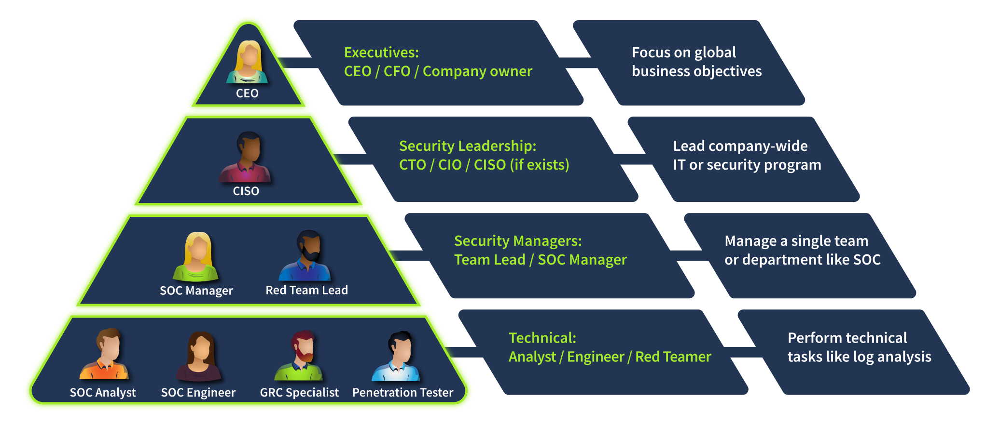.

Looking at the diagram above, top executives like the CEO usually focus on global business objectives and don't manage technical aspects. That's why they hire a Chief Information Security Officer (CISO) or a similar role who knows the business needs and can create the most suitable security departments.

#### Security Departments
In tiny companies, the IT department takes the role of securing the company. Small to medium-sized companies may have a generic "Information Security" team that does all sorts of tasks. For this room, we will focus on bigger companies with a CISO overseeing multiple security teams, each handling a specific task. For example:

**Red Team:** Offensive security experts, pentesters, or ethical hackers who look for security issues

**GRC Team:** Specialists managing policies and ensuring compliance with regulations like PCI DSS

**Blue Team:** Defensive security experts like SOC analysts, engineers, or incident responders


### Security Operations Center (SOC)

Blue Team is about defensive security, meaning it constantly monitors for attacks and tries to respond to them quickly. Depending on a company's size and sector, Blue Team can include a lot of different roles and subdepartments, usually counting 3 to 50 members total. Now, let's explore the most common Blue Team departments.

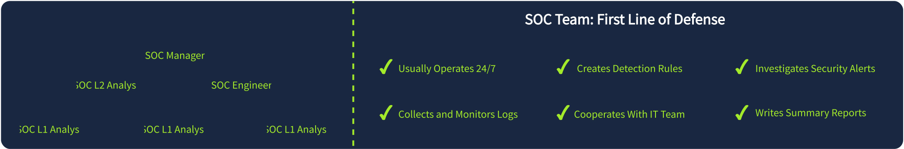.


That's where you are most likely to start your cyber security journey! SOC is the central hub for an organization's cyber security - they are the first line of defense, work with various alerts, and handle most attacks. You can read more about SOC structure in this room, but an efficient SOC is usually composed of the following roles:

**L1 Analysts:** Junior members who triage alerts and pass complex cases to L2

**L2 Analysts:** Experienced members who investigate more advanced attacks

**Engineers:** Experts in configuring security tools like EDR or SIEM

**Manager:** A person who manages the whole SOC team

### Cyber Incident Response Team (CIRT)

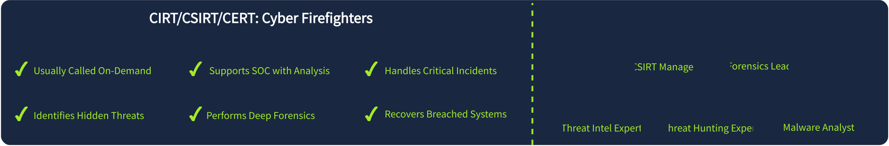.

If SOC expertise is not enough or the incident goes out of control, you urgently call the "firefighters" - CIRT, also called CSIRT or CERT. The members should have a broad knowledge of cyber threats and handle breaches without depending on tools like EDR (Endpoint Detection and Response) or SIEM. A CIRT job is stressful and responsible, but also rewarding. Here are a few CIRT examples:

JPCERT: Japan's CERT handling nation-wide breaches
Mandiant: A private team responding to global cyber incidents
AWS CIRT: Investigates security incidents of AWS customers

### Specialized Defensive Roles

.

Large companies, technology-focused startups, and government agencies often require narrow and specialized Blue Team roles - exciting and highly valuable, but requiring deep topic knowledge and broad experience in broader fields like SOC or IT. These narrow roles can include:

**Digital Forensics Analyst:** Uncover hidden threats in disk and memory
**Threat Intelligence Analyst:** Gather data about emerging threat groups
**AppSec Engineer:** Maintain a secure software development lifecycle
**AI Researcher:** Study AI threats and how to defend against them

### SOC Path
Starting as a SOC L1 analyst may be a great option to broaden your cyber world awareness and better understand the more specialized roles. Moreover, even the entry-level SOC L1 role can be fun and engaging: You will deal with real attacks, protect the company from advanced threat groups, and learn a lot during the process. 

#### Internal SOC vs MSSP
Not every organization has the expertise to operate a SOC on its own and relies on a Managed Security Services Provider (MSSP), a company that delivers outsourced security services, most commonly SOC, to its clients. Working at MSSP is typically high-pressure, but it is also a good option to quickstart your career. While we recommend applying for any open SOC position as your first job, it's also important to understand the differences:

Internal SOC vs MSSP Comparison

| Topic | Internal SOC | MSSP |
|-------|-------------|------|
| **Scenario Example** | You work in a SOC team of the bank and protect the bank's systems | You work for a global MSSP protecting its sixty customers in Europe |
| **Working Pace** | You usually have calm shifts without too much time pressure | Your shift usually starts from a queue of urgent alerts to analyze |
| **Security Tools** | You work with just a few tools, but need to know them very well | You have to work with sixty diverse security tools and platforms |
| **Incident Practice** | You saw and learned from just two major cyber attacks last year | Every week, you deal with attacks and breaches, and can learn from it |

### SOC L1 Alert Triage

#### From Events to Alerts

First, an event must occur, like user login, process launch, or file download. Then, the system, like your OS, a firewall, or a cloud provider must log the event. After that, all system logs must be shipped to a security solution like SIEM or EDR. The SOC team can receive millions of logs per day from thousands of different systems, where most of the events are expected, but some require attention. Alert, a notification generated by a security solution when a specific event or sequence of events occurs, is what saves SOC analysts from manual log review by highlighting only suspicious, anomalous events. With alerts, analysts triage just dozens of alerts per day instead of millions of raw logs.

**Alert Management Platforms**

| Solution        | Examples                     | Description |
|----------------|------------------------------|------------|
| SIEM System    | Splunk ES, Elastic           | SIEM systems have solid alert management capabilities and are a perfect choice for most SOC teams. |
| EDR or NDR     | MS Defender, CrowdStrike     | While EDR and NDR provide their own alert dashboards, it is preferred to use SIEM or SOAR for centralized alert management. |
| SOAR System    | Splunk SOAR, Cortex SOAR     | Larger SOC teams can use SOAR to aggregate and centralize alerts from multiple security solutions. |
| ITSM System    | Jira, TheHive                | Some teams may have a custom ticket management (ITSM) setup using a dedicated solution. |

### L1 Role in Alert Triage
SOC L1 analysts are the first line of defence, and they are the ones who work with alerts the most. Depending on various factors, L1 analysts may receive zero to a hundred alerts a day, every one of which can reveal a cyberattack. Still, everyone in the SOC team is somehow involved in the alert triage:

* SOC L1 analysts:  Review the alerts, distinguish bad from good, and notify L2 analysts in case of a real threat
* SOC L2 analysts:  Receive the alerts escalated by L1 analysts and perform deeper analysis and remediation
* SOC engineers:  Ensure the alerts contain enough information required for efficient alert triage
* SOC manager:  Track speed and quality of alert triage to ensure that real attacks won't be missed

Now that you know how alerts are generated, it's time to review their content. While the details differ for every SIEM or security solution, the alerts generally have a few main properties you must understand before taking them. Don't worry if you find some confusing, as you will hear more about some in the upcoming tasks.

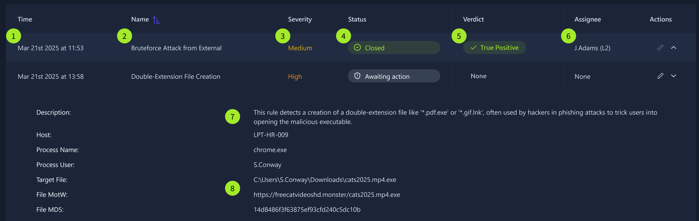.

## Alert Properties

| No | Property            | Description | Examples |
|---|---------------------|------------|----------|
| 1 | Alert Time          | Shows alert creation time. The alert usually triggers a few minutes after the actual event. | Alert Time: March 21, 15:35 <br> Event Time: March 21, 15:32 |
| 2 | Alert Name          | Provides a summary of what happened, based on the detection rule's name. | Unusual Login Location <br> Email Marked as Phishing <br> Windows RDP Bruteforce <br> Potential Data Exfiltration |
| 3 | Alert Severity      | Defines the urgency of the alert. Initially set by detection engineers, but can be altered by analysts if needed. | 🟢 Low / Informational <br> 🟡 Medium / Moderate <br> 🟠 High / Severe <br> 🔴 Critical / Urgent |
| 4 | Alert Status        | Indicates whether someone is working on the alert or if triage is completed. | 🆕 New / Unassigned <br> 🔄 In Progress / Pending <br> ✅ Closed / Resolved <br> (Custom statuses may exist) |
| 5 | Alert Verdict       | Also called alert classification. Explains whether the alert is a real threat or false alarm. | 🔴 True Positive / Real Threat <br> 🟢 False Positive / No Threat <br> (Custom verdicts may exist) |
| 6 | Alert Assignee      | Shows the analyst assigned to review the alert. The assignee takes responsibility for handling it. | Assignee may also be called Alert Owner |
| 7 | Alert Description   | Explains what the alert is about, usually structured in three parts. | Detection rule logic <br> Why the activity may indicate an attack <br> Optional triage guidance |
| 8 | Alert Fields        | Contains SOC analyst comments and values that triggered the alert. | Affected Hostname <br> Entered Command Line <br> Other relevant technical fields |


Okay, you can now read and understand the alert. What's next? Recall the second task, where you see hundreds of alerts but have to choose which to pick up first. The process of deciding which to take is called Alert Prioritisation, and it is crucial to ensure timely detection of a threat, especially with many alerts in the queue.

Finally, you are ready to review the chosen alert! The process is quite operationally heavy, but you will soon see why every step is important. Also, note that the alert review by SOC analysts can also be called alert triage, alert handling, alert processing, alert investigation, or alert analysis. During this module, we will stick to the Alert Triage option.

.

#### Initial Actions
The initial steps are designed to ensure that you take ownership of the assigned alert and avoid interfering with alerts being handled by other analysts, and confirm that you are fully prepared to proceed with the detailed investigation. You achieve it by first assigning the alert to yourself, moving it to In Progress, and then familiarising yourself with the alert details like its name, description, and key indicators.

#### Investigation
This is the most complex step, requiring you to apply your technical knowledge and experience to understand the activity and properly analyse its legitimacy in SIEM or EDR logs. To support L1 analysts with this step, some teams develop Workbooks (also known as playbooks or runbooks) - instructions on how to investigate the specific category of alerts. If workbooks are not available, below are some key recommendations:

Understand who is under threat, like the affected user, hostname, cloud, network, or website
Note the action described in the alert, like whether it was a suspicious login, malware, or phishing
Review surrounding events, looking for suspicious actions shortly after or before the alert
Use threat intelligence platforms or other available resources to verify your thoughts

#### Final Actions
Your decisions here determine whether you found or missed the potential cyberattack. Some actions like Escalation or Commenting will be explained in the following rooms, so don't worry if they sound complex right now. First, decide if the alert you investigated is malicious (True Positive) or not (False Positive). Then, prepare your detailed comment explaining your analysis steps and verdict reasoning, return to the dashboard and move it to the Closed status.

### SOC L1 Alert Reporting

In the previous room, you learned how to classify and triage the alerts. But you might be curious about what happens next. How does your triage help prevent threats and stop breaches? This is a whole new topic that this room will cover soon, but for now, let's recall the path of the alerts.

First, L1 analysts receive the alerts in a SIEM, EDR, or a ticket management platform. Most of the alerts are closed as False Positives or are handled on L1 level, but complex and threatening ones are sent to L2 that remediate most breaches. And to send the alerts further, you need to learn three new terms: reporting, escalation, and communication.

**Alert Reporting**

Before closing or passing the alert to L2, you might have to report it. Depending on team standards and alert severity, instead of a short alert comment, you can be required to document your investigation in detail, ensuring all relevant evidence is included. This is especially important for True Positives, which require escalation.

**Alert Escalation**

If the True Positive alert requires additional actions or deeper investigation, escalate it to the L2 analyst for further review following the agreed procedures. That's where your alert report comes in handy since L2 will use it to get the initial context and spend less on the analysis from scratch.

**Communication**

You may also need to communicate with other departments during or after the analysis. For example, ask the IT team if they confirm granting administrative privileges to some users or contact HR to get more information about the newly hired employee.

.

Before we move on, it is essential to clarify why anyone would want L1 analysts to write reports in addition to marking them as True or False Positives and why this topic can not be underestimated. Having L1 analysts write alert reports serves several key purposes:

### Alert Report Purpose

| Alert Report Purpose              | Explanation |
|------------------------------------|------------|
| Provide context for escalation     | A well-written report saves significant time for L2 analysts and helps them quickly understand what happened. |
| Save findings for the records      | Raw SIEM logs are typically stored for 3–12 months, while alerts are often retained indefinitely. Therefore, it is best practice to keep all relevant context within the alert itself. |
| Improve investigation skills       | “If you can't explain it simply, you don't understand it well enough.” Writing reports strengthens L1 analyst skills by summarizing findings clearly and concisely. |

### Report Format
An example of good, structured report following the 5Ws approach

.

Imagine yourself as an L2 analyst, a DFIR team member, or an IT professional who needs to understand the alert. What would you want to see in the report? We recommend you follow the Five Ws approach and include at least these items in the report:

* *Who:* Which user logs in, runs the command, or downloads the file
* *What:* What exact action or event sequence was performed
* *When:* When exactly did the suspicious activity start and ended
* *Where:* Which device, IP, or website was involved in the alert
* *Why:* The most important W, the reasoning for your final verdict


After you have made a verdict and written your alert report, you must choose whether to escalate the alert to L2. Again, the answer may differ from team to team, but the following recommendations would generally fit most SOC teams. You should escalate the alerts if:

1. The alert is an indicator of a major cyberattack requiring deeper investigation or DFIR
2. Remediation actions like malware removal, host isolation, or password reset are required
3. Communication with customers, partners, management, or law enforcement agencies is required
4. You just do not fully understand the alert and need some help from more senior analysts

### Escalation Steps
To escalate the alert, in most cases, all you have to do is to reassign the alert to the L2 on shift and ping them in corporate chat or in person. In some teams though, you may be required to create a formal written escalation request with dozens of required fields.

.

No matter what the agreements are, L2 will eventually receive the ticket from you, read your report, and contact you in case of any questions. Once everything is clear, the L2 analyst will typically research the alert details further, validate if the alert is indeed a True Positive, communicate with other departments if needed, and, for major incidents, start a formal Incident Response process.

### Requesting L2 Support
It is generally fine for L1 to request senior support if something is unclear. Especially in your first months, it's always better to discuss the alert and clarify SOC procedures than to blindly close the alert you don't understand yourself. The procedures for requesting support may differ, but the flow generally looks like this:


#### SOC Dashboard Escalation

1. Move the alert to In Progress status and do the analysis
2. Write an alert report and set your verdict, such as True Positive
3. If escalation is required, assign the alert to your L2 on shift
4. L2 will receive a notification and start from your alert report

.

The escalation and reporting topics should sound straightforward and logical to you. But, as always, it's easier said than done, and you should be prepared for unexpected scenarios and know what to do in critical cases. In the best scenario, the SOC team has its own Crisis Communication procedures - the guides and processes to help you and your teammates resolve the issues. If not, you are advised to read the cases below and be prepared to handle them effectively.

**Communication Cases**

* **You need to escalate an urgent, critical alert, but L2 is unavailable and does not respond for 30 minutes.**
Ensure you know where to find emergency contacts. First, try to call L2, then L3, and finally your manager.

* **The alert about Slack/Teams account compromise requires you to validate the login with the affected user.**
Do not contact the user through the breached chat - use alternative contact methods like a phone call.

* **You receive an overwhelming number of alerts during a short period of time, some of which are critical.**
Prioritise the alerts according to the workflow, but inform your L2 on shift about the situation.

* **After a few days, you realise that you misclassified the alert and likely missed a malicious action.**
Immediately reach out to your L2 explaining your concerns. Threat actors can be silent for weeks before impact.

* **You can not complete the alert triage since the SIEM logs are not parsed correctly or are not searchable.**
Do not skip the alert - investigate what you can and report the issue to your L2 on shift or SOC engineer.

### Communication By L2

.

## Introduction to EDR

The increase in the use of digital devices is undeniable. Most of the business's core functions rely on the use of these digital devices. Cyber threats, on the other hand, are also increasing day by day. To protect these devices, organizations implement several security measures, most of which are to protect the network on which they operate these digital devices. However, the fast adoption of Remote Work has exposed these devices as they are out of the perimeter protection deployed on the organization's network. 

To ensure these endpoint devices are protected even out of the network, we need a security solution that guards all devices in different areas and is capable of fighting advanced threats. Endpoint Detection and Response (EDR) is a security solution that offers deep-level protection for endpoints. No matter where the endpoints are, the EDR will make sure they are monitored constantly and threats are detected.

Below are some of the EDR solutions in the market:

* CrowdStrike Falcon
* SentinelOne ActiveEDR
* Microsoft Defender for Endpoint
* OpenEDR
* Symantec EDR

Several other EDR solutions are available in the market. Their underlying architecture is mostly similar, but the features may vary.

Let's take a look at the core features of an EDR. We will be using the screenshots from CrowdStrike Falcon EDR to demonstrate the core features of EDR.

### Features of EDR
There are three main features of an EDR, which can also be referred to as the three pillars of an EDR solution.

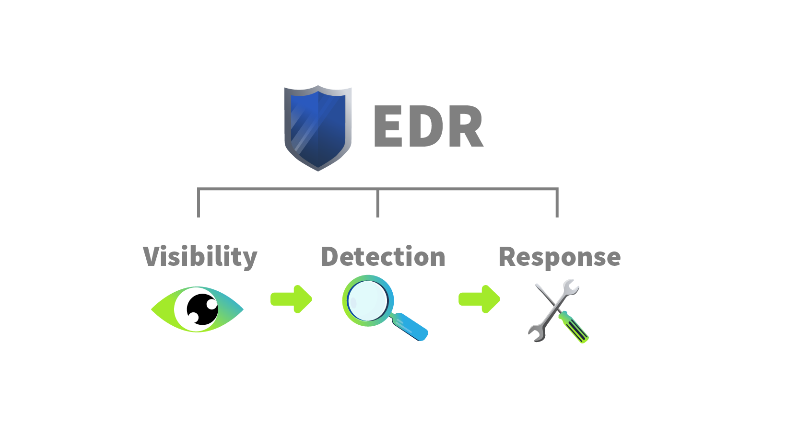.

### Visibility 

A good analysis often depends on the available level of visibility of the activity. This is one of the features of EDR that makes it unique from other endpoint security solutions. The level of visibility EDR provides is impressive. It collects detailed data from the endpoints, which includes process modifications, registry modifications, file and folder modifications, user actions, and much more. It then presents this information in a very structured format to the analyst. The analyst can see the whole process tree with a complete activity timeline of the sequence of actions. The analyst can also access the historical data of any endpoint for threat hunting or any other purpose. Any detections in the EDR land with a whole context.

Process Modifications >	Registry Modifications > File And Folder Modifications > User Actions	> And Much More

The following screenshot shows graphical representation of a process tree. We can see which processes were spawned on the endpoint. Each node represents a process. The lines connecting them represents their relationship. If we click on the + icon given with each process, we will be able to see all the network connections, registry changes, file changes etc. associated with that process. 

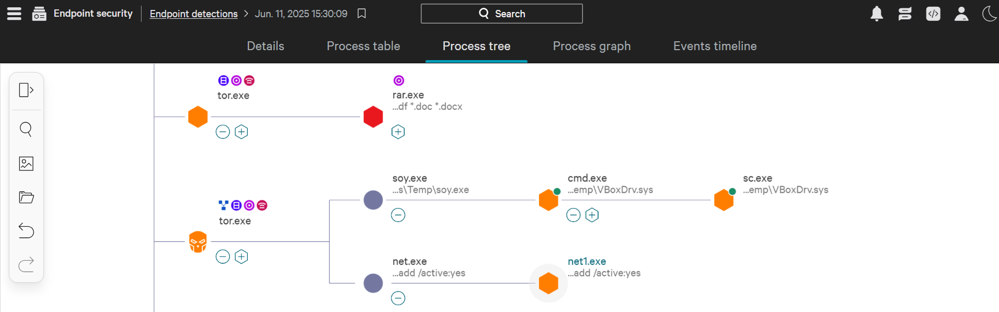.

Along with the process trees, there are many other features available in the EDRs which maximize the visibility. 

### Detection 
The detection feature of EDR wins over traditional detection capabilities. It incorporates signature-based detections as well as behavior-based detections, such as unexpected user activities. With modern machine learning capabilities, it identifies any deviation from the baseline behavior and instantly flags it. It can also detect fileless malware that resides in memory. It also allows us to feed custom IOCs for threat detections.

The following screenshot shows a dashboard of all the detections happening on the different endpoints. Each detection is represented by a row with different fields including the severity of the detection, time, triggering file, hostname, username, and more. The Tactic via Technique field maps the detection with MITRE. Any detection when clicked will show us rich details which helps a SOC analyst during the analysis.

.

### Response 

EDR also empowers analysts to take action on detected threats. These actions can be taken at any endpoint within the central EDR console. Imagine getting a detection on the EDR with full-fledged details on when, where, and what happened, and you have to opt for the best possible action for that detection. As an analyst, you may decide to isolate a complete endpoint, terminate a process, or quarantine some files. You can also connect to the host remotely and execute actions independently. You can do this all from within the EDR console.

The following screenshot shows the actions available that can be taken on the host after connecting to it. 

.

There are several other actions that the analyst can take during the investigation.

Note: In Task #6, we will be covering the Detection and Response capabilities of an EDR in more detail.

With advanced visibility, detection, and response, EDR becomes a very powerful tool. However, it's also important to remember that an EDR is a host-only security solution and does not detect network-level threats.

#### Why do we need an EDR when we already have an Antivirus (AV) on the endpoints?
Both of these security solutions have the same motive of protecting the endpoint on which they are installed. However, both differ in the level of protection they provide. Let's assume an airport is an endpoint that needs protection. One layer of protection is to check the passports of people when they pass through immigration. The immigration check (AV) monitors incoming people and matches their passports with a list of known criminals in its database. If there is a match, the entry is blocked and caught. 

Sounds like a smart protection, right?

But, what happens if somebody who has never been identified as a criminal in the past and has an innocent personality tries to come in? The immigration check will let them in. Now, what if this innocent person were a professional thief trained to evade basic security? The airport has an undetected threat inside!

This is where an EDR comes in.

An EDR in this analogy would be the security officers stationed inside the airport (endpoint). These security officers would constantly monitor the security cameras and motion sensors in the airport (endpoint). Compared to the immigration check (AV), the security officers (EDR) enhance the protection of the airport (endpoint) through CCTV monitoring and motion sensors. Even if somebody manages to evade the immigration check, the security officers will constantly be monitoring their actions, such as:

Are they roaming close to restricted areas?
Is their behaviour suspicious?
Are they leaving their bags somewhere unattended?
The security officers can also take action if something does not feel right to them or alert the airport management with complete details of what happened.

The Antivirus (AV) may detect some basic threats, but to detect advanced threats that evade normal detections, we need an EDR. Unlike antivirus software's basic signature-based detection, it monitors and records the behaviors of the endpoint. An EDR also provides organization-wide visibility of any activity. For example, if a suspicious file is detected on one endpoint, the EDR will also check it across all the other endpoints.

Let's examine an advanced malicious activity step by step on an endpoint and compare the response of an AV and EDR at each stage.

#### Scenario Breakdown
* Step #1: A user receives a phishing email with a Word document embedded with a malicious macro (VBA script)
* Step #2: The user downloads the document and opens it
* Step #3: The malicious macro is silently executed, and it spawns PowerShell
* Step #4: The malicious macro runs an obfuscated PowerShell command to download a sophisticated second-stage payload
* Step #5: The payload is injected into a legitimate svchost.exe
* Step #6: The attacker gains remote access to the system

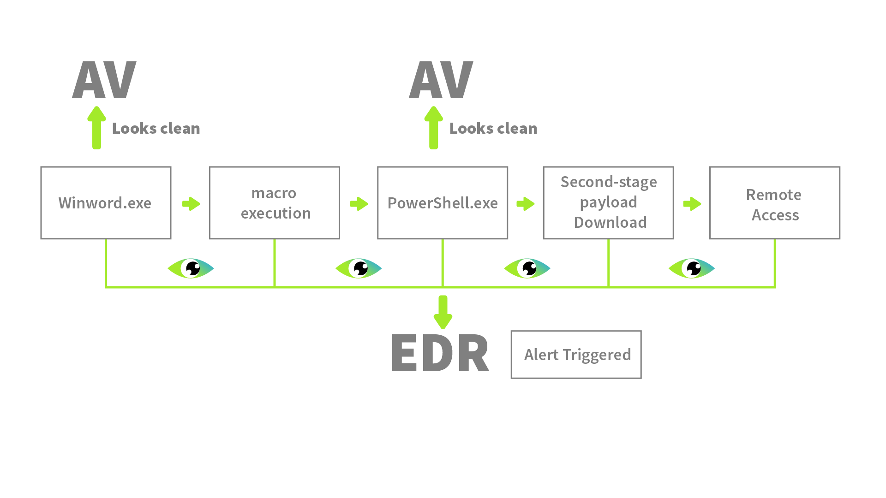.

| Attack Steps | AV's Response | EDR's Response |
|---|---|---|
| Step #1 | Does nothing if the downloaded file has no previous signature in the database | Logs the file download activity and monitors it |
| Step #2 | Does nothing upon the opening of the document since winword.exe is a legitimate utility | Records the execution of winword.exe and keeps monitoring |
| Step #3 | Does nothing if the executed macro has no previous signature | Detects and flags the macro execution due to the unusual parent-child relationship of winword.exe and PowerShell.exe processes |
| Step #4 | Typically, AVs will not detect obfuscated PowerShell scripts | Flags the obfuscated script execution |
| Step #5 | Will not flag malicious injection into svchost.exe since it does not monitor the memory injections | Detects Process Injection in svchost.exe |
| Step #6 | Lacks Network Level Visibility | Flags the unexpected behaviour of svchost.exe, making an outbound connection |
| Final Action | May be marked as clean | Generates an alert with the full attack chain and enables the analyst to take actions from within the EDR |

In the previous tasks, we saw how powerful an EDR is for an endpoint. However, do you know:

* How does an EDR manage to provide this much visibility of the endpoints?
* How can it detect advanced threats?
* How can a few clicks eradicate the threat from an endpoint?

This seems like magic. Let's try to understand it in a very simple way.

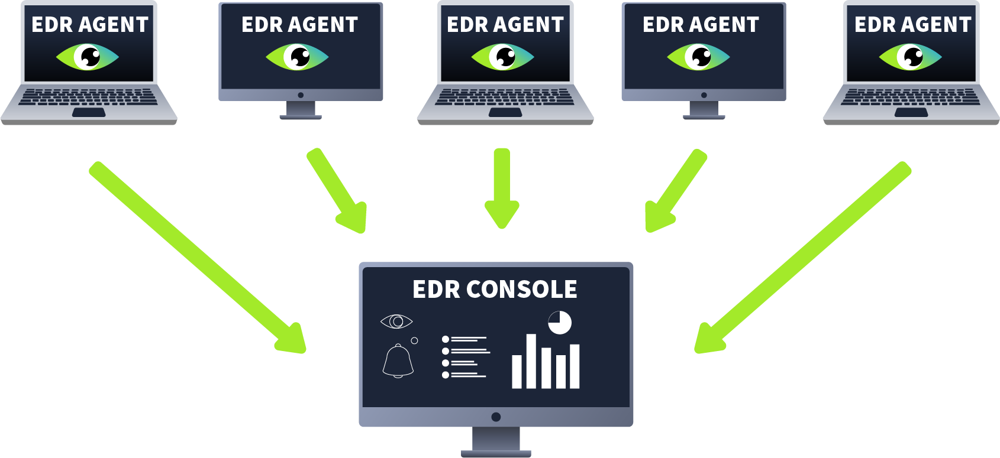.

### Agents

We can integrate multiple endpoints with our EDR and manage them through a centralized console. There are EDR agents that we have to deploy inside those endpoints. These agents are also sometimes referred to as sensors. They are the eyes and ears of the EDR. Their job is to sit at the endpoint and monitor all the activities. The information about these activities is sent in detail to the EDR central console in real time. The EDR agents can do some basic signature-based and behavior-based detections by themselves and send them to the EDR console, which triggers alerts.

### EDR Console

All the detailed data sent by the EDR agents is correlated and analyzed through complex logic and machine learning algorithms. The threat intelligence information is matched with the collected data. The EDR is just like the brain connecting all the dots. These dots connect to form a detection, often called an alert. 

The following screenshot shows the dashboard of an EDR console. All the data from the endpoint agents is coming into this console, and the detections are happening here. This dashboard gives a holistic view of the current status of detections in all the endpoints. 

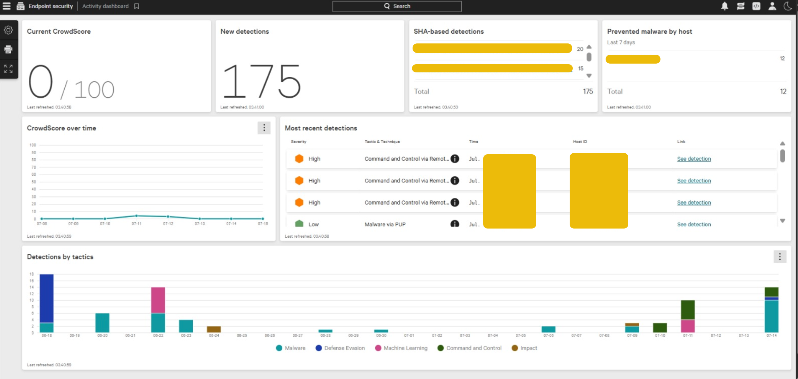.

#### What happens after Detection?

When a detection comes, it's a SOC analyst's responsibility to acknowledge the alert and prioritize it. The prioritization is made easy by the EDR itself. It gives severities to all the alerts (Critical, High, Medium, Low, Informational). The alert with the highest severity is investigated as a priority. For the investigation, once the alert is clicked, the analyst can see all the details of the detection. This includes any files executed, processes executed, network connection attempts, registry modifications, and much more. Based on the available data, the analyst's job is first to use their expertise to determine if the alert is a false positive or a true positive. In case of a true positive, the analyst can take actions from within the EDR console. 

#### EDR with Other Tools

As a SOC Analyst, it is essential to understand that although a standalone EDR provides enough information to detect and respond to threats in an endpoint, it works alongside other security solutions to form a larger security ecosystem. Within a network, you will see Firewalls, DLPs, Email Security Gateways, IAMs, EDRs, and other security solutions protecting the different components of the network. To minimize the effort and maximize the efficiency, all these security solutions are integrated with a SIEM solution that becomes the central point of investigation for the analysts. We will also discuss the SIEM solution in detail in the upcoming rooms of this module.

#### What is Telemetry?

In the previous task, we learned about EDR agents, which collect different data from their endpoints and push it to the EDR console. This data is known as Telemetry. Telemetry is the black box of an endpoint with everything necessary for detection and investigation.

#### Collected Telemetry

Usually, many activities are going on in the endpoints, most of which are legitimate. It is often difficult to differentiate between regular and malicious activity. The more data is collected, the better judgments can be made. EDR collects detailed telemetry from the endpoints. Let's take a brief look at some of the telemetry that it collects:

* Process Executions and Terminations

It keeps track of all the running and idle processes, which helps to identify suspicious child-parent process relationships, suspicious executables initiating a process, malware payload, etc.

* Network Connections

All the endpoints' network connections are monitored, which helps identify any connection to a C2 server, unusual port usage, data exfiltration, or lateral movement within the network.

* Command Line Activity

It captures all the commands executed on the endpoints in CMD, PowerShell, etc., which helps to identify malicious command execution, obfuscated PowerShell script executions, which are often missed by a traditional antivirus.

* Files and Folders Modifications

Threat actors modify different files and folders during data staging, ransomware executions, and malicious file dropping. The EDR tracks this.

* Registry Modifications

The registry is a goldmine of information about the configurations in a Windows system. There are many registry modifications that occur during a malicious activity, and most of these are monitored by the EDR.


EDR collects much more than this data from an endpoint. It uses complex logic and machine learning algorithms to assess the activities. Advanced threats keep most of their activities stealthy, using legitimate utilities during execution. Individually, their activities may seem harmless, but when observed through detailed telemetry, they tell a different story. This detailed telemetry not only helps the EDR detect advanced threats and make better judgments on the legitimacy of the activities, but it is also very helpful for the analysts during the investigations. The analysts can understand the full chain of events, identify the root cause, and reconstruct the attack timeline.

### Detection
Based on the telemetry received from the endpoints, some advanced detection techniques are applied to this data. Some of these techniques include:

* Behavioral Detection

Instead of just matching the signatures with known threats, it observes the complete behavior of a file. Advanced threats craft their malware to look clean and use legitimate processes to carry out their attack. EDR catches this behavior.

Example: A process winword.exe spawning PowerShell.exe will be flagged by the EDR due to the behavior. A Word document spawning a PowerShell is an unusual parent-child relationship.

* Anomaly Detection

With time, EDR understands the baseline behavior of the endpoints. Any activity that deviates from this behavior will be flagged. During any malicious activity, the endpoint's behavior deviates from normal. EDR picks it up. Sometimes, this can generate false positives as well. However, with the full context it gives, the analyst can identify its legitimacy.

Example: On one of the endpoints, a process modifies an auto-start registry key, which is not a common behavior on the endpoint.

* IOC matching

EDRs have some strong threat intelligence field integrations. Except for zero-day attacks, most of the attacks have indicators published in the threat intelligence feeds. EDR flags any activity that matches any known IOC.  Example: A user downloads a file that drops an executable. The executable is often used in a specific attack. The hash of this executable will get matched with the threat intelligence feed and instantly flagged by the EDR.

* MITRE ATT&CK Mapping

Any activity flagged by the EDR is not only marked as malicious or suspicious but also mapped with the MITRE Tactic and Technique (attack stage) that the particular activity was on. This proves to be very helpful for the analysts.

Example: If the EDR flags the creation of a scheduled task for any reason, it will likely map this activity to the following:
  * Tactic: Persistence
  * Technique: Scheduled Task/Job

* Machine Learning Algorithms

Advanced threat actors try to evade defenses as much as possible, and their activities may sometimes bypass advanced detection techniques. Modern EDRs have machine learning models trained by a large dataset of normal and malicious behaviors. This can detect complex patterns of an attack.

Example: Attacks in which the individual actions are not inherently malicious, but the ML algorithm identifies the whole chain of activities as malicious. Fileless attacks and multi-staged intrusions are often detected through this.

### Response
The next step after any detection is the response. EDR offers both automated and manual responses. You can make policies to block known malicious behaviors automatically. However, manual response gives you a wide range of response capabilities. Let's discuss some of them.

* Isolate Host

During any malicious activity on an endpoint, you can isolate that endpoint from the network through EDR. This is a very effective function for containing malicious activity. Most attacks start from a single endpoint and move laterally to other endpoints to compromise the whole network. Isolating the infected endpoint on time can stop this from happening.

* Terminate Process

Not every malicious activity requires host isolation. Some hosts run the core business operations, and isolating them can cause more loss than the malicious activity. In such cases, terminating a process is enough to neutralize the malicious activity. The analysts get this option in the EDR. They can terminate any process at any time. This action should be taken consciously since terminating a legitimate process can disrupt the endpoint.

* Quarantine

If a malicious file comes into the endpoint, it can be quarantined. Quarantine ensures that the file is moved to an isolated location where it can not be executed. The analysts can then review the file to restore or permanently remove it. 

* Remote Access

Analysts can also remotely access the shell of any endpoint. This is often done when the EDR's built-in response is not enough to take action on a specific activity. Through remote access, analysts can gain deeper visibility into the system or take custom actions within the endpoints. The analysts can also run scripts or collect their desired data from the host through remote access.

Below is an example of CrowdStrike Falcon EDR's RTR (Real Time Response) console, which allows analysts to remotely access the shell of any endpoint and run commands and scripts.

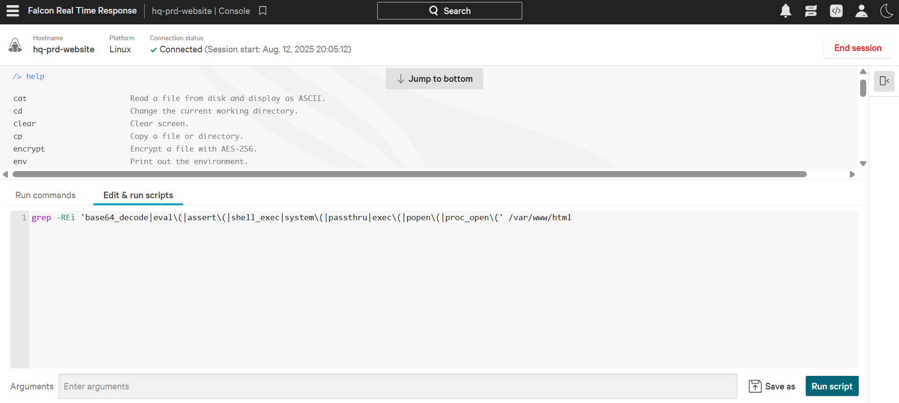.

* Artefacts Collection

Sometimes, the analysts may need to extract some data from the endpoints for detailed forensic investigation or reporting for legal actions. Analysts can extract important artefacts from the endpoints without physically accessing the device. The most commonly extracted artefacts include:
  * Memory Dump
  * Event Logs
  * Specific Folder Contents
  * Registry Hives

The Detection and Response capabilities of EDR solutions differ from those of traditional endpoint protection solutions. Modern EDRs are introducing more advanced detection techniques.

## Introduction to SIEM

### Logs Everywhere

Multiple devices in a network communicate with each other and, most of the time, with the Internet through a router. The image below shows an example of a simple network that comprises multiple Linux/Windows-based Endpoints, one data server, and one website.

.

These devices continuously generate logs of the activities that occur within them. We can also call these devices log sources. The logs they generate serve as a trail of all the activities and are extremely helpful for identifying malicious activities or general troubleshooting. These log sources are mainly divided into two categories, which are discussed below.

#### 1) Host-Centric Log Sources
These log sources capture events that occurred within or related to the host. Devices that generate host-centric logs include Windows, Linux, servers, etc. Some examples of host-centric logs are:

* A user accessing a file
* A user attempting to authenticate.
* A process execution activity
* A process adding/editing/deleting a registry key or value.
* PowerShell execution

#### 2) Network-Centric Log Sources
Network-related logs are generated when the hosts communicate with each other or access the internet to visit a website. Devices that generate network-centric logs are firewalls, IDS/IPS, routers, etc. Some examples of network-centric logs are:

* SSH connection
* A file being accessed via FTP
* Web traffic
* A user accessing the company's resources through VPN.
* Network file sharing Activity

Together, these host-centric and network-centric log sources constantly create numerous logs in a network. 

#### Answers Nowhere

Until now, it seems pretty straightforward that these log sources generate logs, we analyze them, and identify malicious activities. However, it's not that simple. It has some challenges. Some of them are discussed below:

* Numerous Log Sources

A network has many log sources, which generate hundreds of events per second. These logs are scattered across different devices, and examining the logs on each device one by one in case of an incident can be tedious.

* No Centralization

As logs reside on the machines on which they are generated,  you may need to connect with each log source via SSH, RDP, etc., to analyze logs from multiple log sources. This is very inefficient and can waste a lot of your valuable time during the investigations.

* Limited Context

Individual logs cannot tell the whole story of an activity. During any incident, the individual activities on different log sources may seem harmless. But if these logs are correlated, they can indicate a whole different story. For instance, you observed a file access event in a system, which is generally normal activity. However, if you correlate different log sources, you might come to know that this file was accessed by a user who accessed this machine through lateral movement after compromising another machine in the network.

* Limited Analysis

The log sources generate numerous logs per second, and analyzing all the logs from all the devices manually to identify any abnormal activity is nearly impossible for humans. Realistically, the analysts will miss a lot of important logs in between the analyses due to their huge number.

* Format Issues

Different log sources generate logs in various formats. Analysts need to know all these formats to analyze them, which can be extremely difficult, especially when dealing with numerous log sources in a network.

In the previous task, we saw how different log sources generate numerous logs of various types and the challenges associated with analyzing those logs. So, how can we more efficiently manage this flood of data and extract valuable results?

This is where SIEM comes into play. Security Information and Event Management (SIEM) is a security solution that collects logs from various types of log sources, standardizes their format into a consistent one, correlates them, and detects malicious activities using detection rules.

### Features of SIEM

The SIEM solution not only solves the issues we discussed in the previous task but also provides capabilities to enhance security operations. Let's discuss some of the core features that a SIEM provides.

* Centralized Log Collection

SIEM collects logs from all sources (endpoints, servers, firewalls, etc.) and centralizes them in one place. These logs are pulled through lightweight agents or APIs and populated into the SIEM solution. This solves the problem of jumping on every machine individually to analyze its logs. 

* Normalization of Logs

Raw logs are of different formats and sizes. A Windows log does not look the same as a Linux log. Since a SIEM solution centralizes these logs in one place, it also ensures that all the logs are broken down into different fields and presented in one consistent format. Breaking down a log into several fields for ease of understanding is known as Parsing, and converting all the logs of various log sources into one consistent format is known as Normalization. 

* Correlation of Logs

Individual logs are not very useful. SIEM correlates the logs of different sources and finds any relationship between them. This helps to identify malicious activity by analyzing its pattern. For instance, let's take a look at the following activities happening in a system during a 5-minute timeframe.

* Haris logs in via VPN from an IP that he never has previously used
* Haris accesses some documents on a shared drive
* Haris executed a PowerShell script
* The system makes an outbound network connection

Individually assessed, these activities look fine, but the SIEM solution would correlate these activities, which could point to a potential data exfiltration activity resulting from Haris's compromised VPN credentials.

#### Real-time Alerting
SIEM detects malicious activities based on the rules it contains. Many rules come with a SIEM by default. However, analysts make new detection rules based on their requirements to mature future detections. When the conditions for these detection rules are satisfied, alerts are triggered, and the analysts are notified. Analysts can then investigate these alerts within the SIEM platform.  

### Dashboards and Reporting
Dashboards are the most important components of any SIEM. SIEM presents the data for analysis after being normalized and ingested. The summary of this analysis is presented in the form of actionable insights with the help of multiple dashboards. Each SIEM solution comes with some default dashboards and provides an option for custom Dashboard creation. Below is some of the information that can be found in a dashboard:

* Alert Highlights
* System Notification
* Health Alert
* List of Failed Login Attempts
* Events Ingested Count
* Rules triggered
* Top Domains Visited

An example of a dashboard made in Splunk SIEM is shown below:

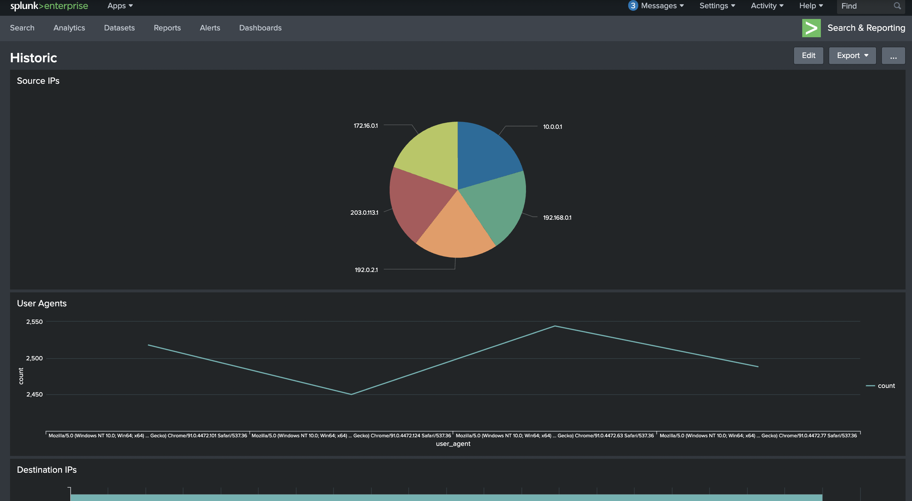.

There are several other features of a SIEM that we will not cover in detail in this room. These features include integration with threat intelligence feeds, extensive data retention, powerful searching capabilities, and many others. 

In the next task, we will discuss different log sources by examining their logs and see how they are ingested into a SIEM solution.

### Log Sources

Every device in the network generates some kind of log whenever an activity is performed on it, such as a user visiting a website, connecting to SSH, logging into their workstation, etc. Let's see what the logs of some common devices that are found in a network environment look like.

### Windows Machine

Windows records every event that can be viewed through the Event Viewer. It assigns a unique ID to each type of log activity, making it easy for the analyst to examine and keep track of. To view events in a Windows environment, type Event Viewer in the search bar. This takes you to the tool where different logs are stored and can be viewed, as shown below. These logs from all Windows endpoints are forwarded to the SIEM solution for monitoring and better visibility.

### Linux Machine

Linux OS stores all the related logs, such as events, errors, warnings, etc. These are then ingested into SIEM for continuous monitoring. Some of the common locations where Linux stores logs are:
```
/var/log/httpd: Contains HTTP Request  / Response and error logs.
/var/log/cron: Events related to cron jobs are stored in this location.
/var/log/auth.log and /var/log/secure: Stores authentication-related logs.
/var/log/kern: This file stores kernel-related events.
```

### Web Server

It is important to monitor all requests/responses coming in and out of the web server for any potential web attack attempt. In Linux, common locations to write all apache-related logs are /var/log/apache or /var/log/httpd.

